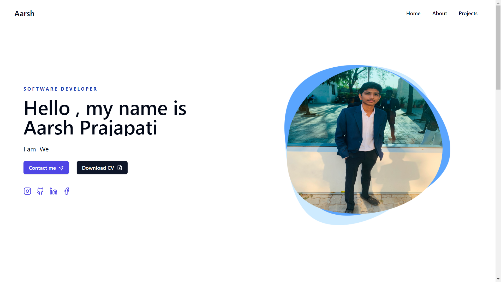
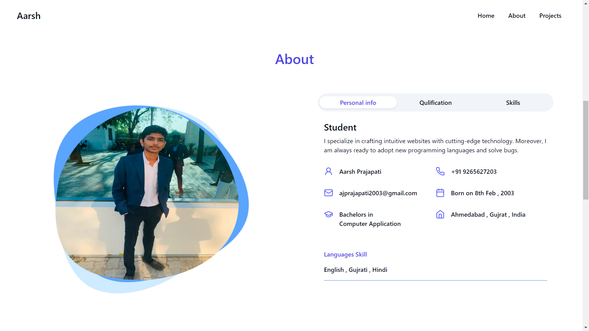
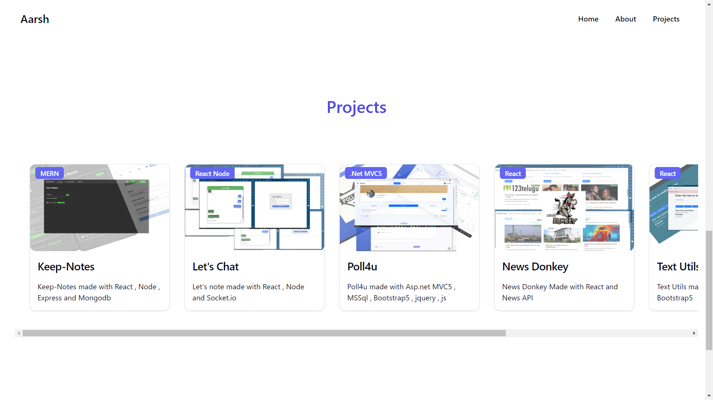
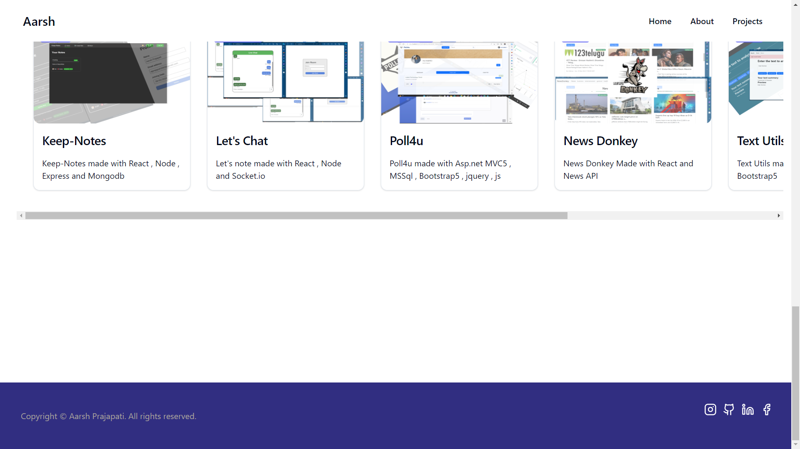
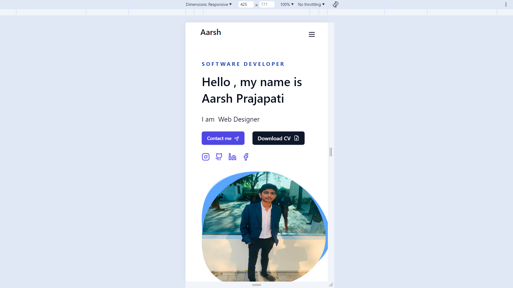
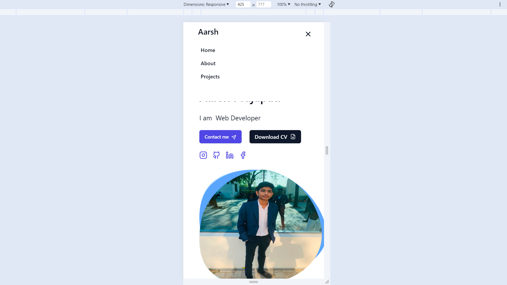
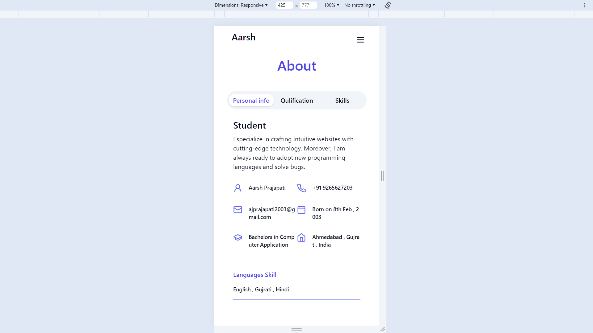
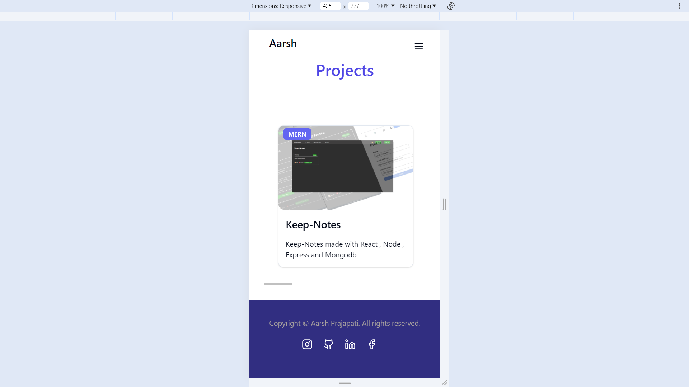

# portfolio

My personal portfolio web application, which demostrate my skills, project , education and personal details

## Tech Stack

React and  Tailwind Css

## Screenshots

## 🔗 Links

## Author

- [@AarshPrajapati](https://github.com/AarshPrajapati)

## 🛠 Skills
Javascript, JQuery, HTML, CSS, Tailwind CSS, Bootstrap, React js, Node js, Express js, Asp.net MVC, php, python, Unix, Mongodb, MSSQL, XAMPP, Orecal
